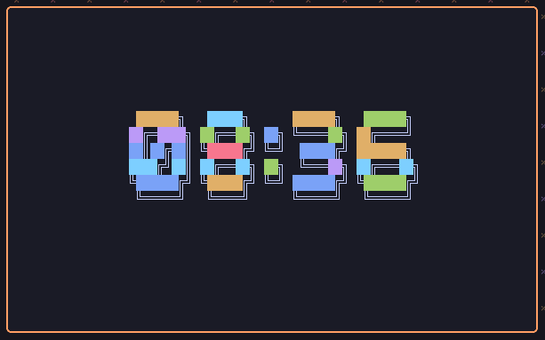
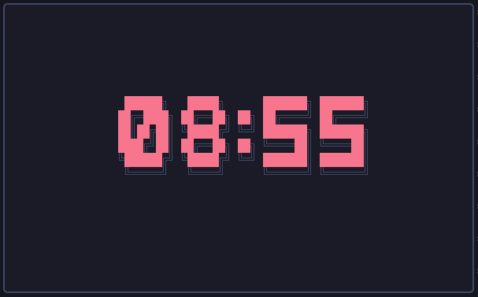
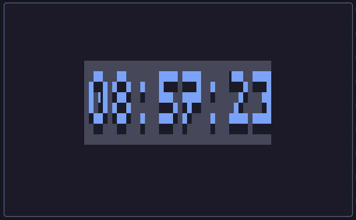
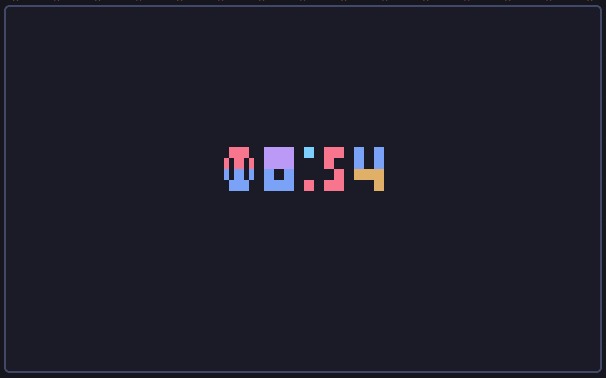
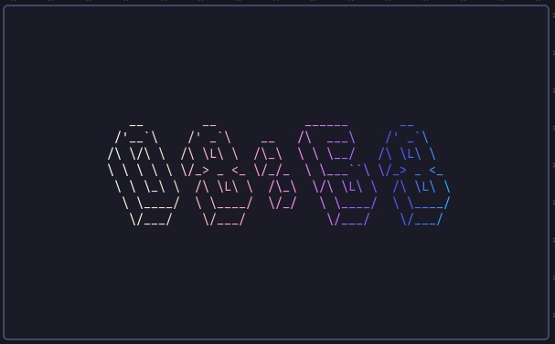

# Tuime



A simple clock for your terminal made using Rust  
## Installation
```sh 
cargo install --git=https://github.com/nate-sys/tuime
```

## Usage

```sh 
tuime
```

### Red and Black with Regular Font
```sh
tuime -c Red -c Black
```


### Blue with Shade Font and Formatted time
```sh
tuime -c Blue --format "%H:%M:%S" -f shade
```


### Colorful with Tiny Font
```sh
tuime -c Candy -f Tiny
```


### Gradient and 3d Font
```sh
tuime -f Simple3d -g '#ffe' -g '#3af'
```

